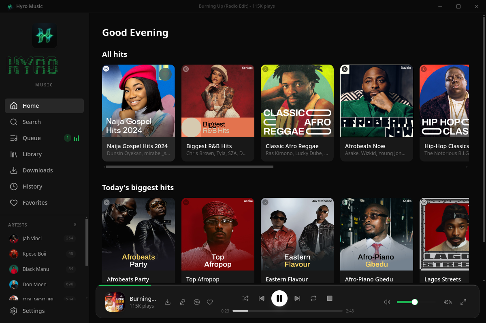

# Hyro Music



Hyro Music is a premium, Spotify-inspired desktop music streaming application built with Electron, React, and Tailwind CSS v4. It fetches rich music metadata directly from YouTube Music and resolves streamable audio URLs on the fly using `yt-dlp`.

---

## Features

- **Premium Spotify-style Design**: A responsive, sleek dark-themed interface built using Tailwind CSS v4 and custom design tokens.
- **Home Feed & Autocomplete Search**: Browse horizontal, scrollable card feeds or use real-time autocomplete suggestions to look up songs, albums, artists, and playlists. Integrates a persistent "Recent Searches" scrollable dropdown when the input is focused, displaying up to 5 items with overflow scroll and individual removal controls.
- **Double-Click Navigation & Backtracking Stack**: Double-click artist names anywhere in the application to navigate directly to their circular profile cards, albums, top tracks, and discographies. Maintains a robust navigation history back-stack so clicking "Go Back" on any detail page reverts to the exact screen you came from instead of redirecting to Home.
- **Pin Artists to Sidebar**: Follow any artist with a single click (`+` button beside their name on the Artist Page, Search, or Home feed) to pin them directly into a dedicated scrollable **Artists** section right inside your left navigation sidebar, featuring their circular profile image next to their name.
- **Custom Frameless Title Bar**: A beautiful custom-branded window title bar containing spinning app logo icons, current track titles, and custom window control buttons (Minimize, Maximize, Close) to match the dark aesthetic scheme across all operating systems. Displays a live circular progress indicator with average percentage during active downloads; clicking this indicator pops open the detailed download queue list.
- **Custom Branding Logo**: Features a premium custom-designed emerald-neon soundwave 'H' emblem (without text) as the official app branding. It is integrated as the application window icon, displayed centered at the top of the Sidebar navigation, spinning in the TitleBar, and rotating inside the Player's full screen overlay when audio is active.
- **Volume Persistence**: Remembers your preferred playback volume percentage across new launches. The volume level is loaded on application startup and dynamically saved with a 500ms debounce as you adjust the volume slider.
- **Synchronized Lyrics**: Pulls synced subtitle cues using Musixmatch (via `musixmlrc`) or LRCLIB's API, using song-duration scoring algorithms to select the best match. Songs with complex names are automatically cleaned via Groq's LLM completions or standard regex cleaners before querying.
- **Full Screen Overlay**: A immersive Spotify-like layout showing blurred cover art backdrops, large controls, auto-scrolling lyrics synchronized to the track, activity-based auto-hiding controls (when music is playing), and a bold animated watermark backdrop of the ASCII project logo.
- **Real-Time Play History & Search**: Automatically logs tracks you play to a local database. Includes a real-time keyword search bar in the History tab to filter and select matching logs, dynamically updating play queues to your search results.
- **Offline Library & Downloads Screen**: Download individual songs, full albums, or playlists as MP3s. Keeps your directories clean by avoiding cover art JPG storage for single tracks (retaining them only for albums and playlists) and writing metadata JSON sidecars securely to the project's config directory instead of the downloads folder. Dynamically verifies physical `.mp3` files on disk (on focus or delete actions) to automatically clear registry logs and prompt users to re-download if a file was deleted. Check progress on an auto-hiding popup or manage items in the dedicated Downloads screen.
- **Smooth Playback Pre-Caching**: Pre-downloads the next three tracks in your queue sequentially into a local cache directory. Utilizes a privileged Electron custom scheme (`media://`) to serve cached audio and images securely without CORS or sandbox policy restrictions.

---

## Tech Stack

- **Desktop Shell**: [Electron 33](https://www.electronjs.org/)
- **Frontend Framework**: [React 18](https://react.dev/)
- **Bundler & Toolchain**: [electron-vite 2](https://electron-vite.org/) & [Vite 6](https://vite.dev/)
- **Language**: [TypeScript 5.6](https://www.typescriptlang.org/) (Strict Mode)
- **Styling**: [Tailwind CSS v4](https://tailwindcss.com/) & [Radix UI](https://www.radix-ui.com/)
- **Iconography**: [Lucide React](https://lucide.dev/)

---

## Installation & Setup

### Prerequisites

Hyro Music relies on **`yt-dlp`** to resolve streaming links and download audio. You must have it installed and available in your system's PATH.

- **Linux**:
  ```bash
  sudo wget https://github.com/yt-dlp/yt-dlp/releases/latest/download/yt-dlp -O /usr/local/bin/yt-dlp
  sudo chmod a+rx /usr/local/bin/yt-dlp
  ```
- **macOS** (via Homebrew):
  ```bash
  brew install yt-dlp
  ```
- **Windows** (via winget or Scoop):
  ```cmd
  winget install yt-dlp
  ```

### Getting Started

1. Clone the repository and navigate into it:
   ```bash
   cd hyro
   ```
2. Install npm dependencies:
   ```bash
   npm install
   ```
3. Run the development server (opens Electron window with hot-reloads):
   ```bash
   npm run dev
   ```
4. Build the application for production:
   ```bash
   npm run build
   ```

### Commands

| Command | Action |
|---|---|
| `npm run dev` | Runs the Electron developer environment. |
| `npm run build` | Builds the production bundle of the application. |
| `npm run typecheck` | Runs the TypeScript compiler check across both Node.js (main/preload) and Web (renderer) targets. |

---

## Credits & Attribution

We would like to thank the developer **defy** for assembling and coding this premium desktop wrapper and compiling these modules into a cohesive experience.

This application is built on top of the following incredible open-source third-party libraries:

- **[ytmusic-api](https://github.com/zS1L3NT/ts-npm-ytmusic-api)** by *zS1L3NT*: Used for pulling YouTube Music autocomplete search recommendations, home feeds, album track lists, and artist profiles.
- **[yt-dlp](https://github.com/yt-dlp/yt-dlp)**: High-performance CLI media downloader used for audio URL stream resolution and MP3 downloads.
- **[musixmlrc](https://github.com/zS1L3NT/musixmlrc)**: Handles Musixmatch synchronization and LRC subtitle parsing.
- **[lucide-react](https://lucide.dev/)**: Premium, clean icons used throughout the sidebars, bottom players, and download screens.
- **Radix UI** and **Tailwind CSS**: Providing accessible design primitives and clean utility styling tokens.

---

## License

This project is licensed under the [MIT License](LICENSE).
